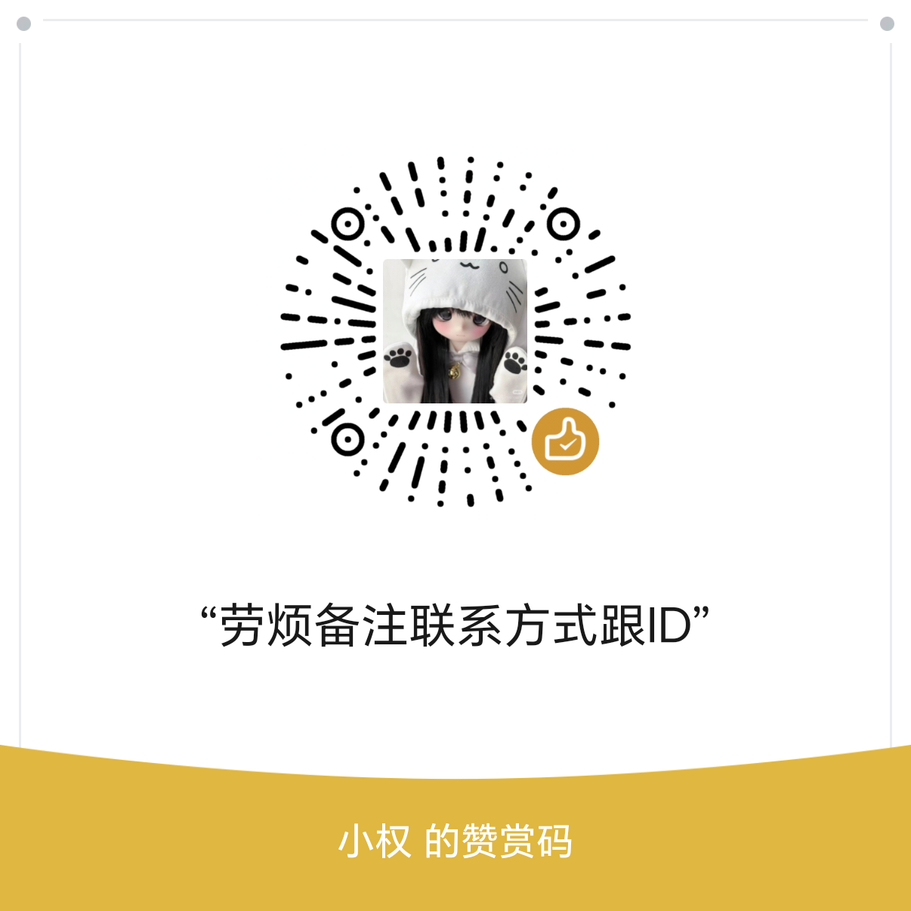

# AI Chat Platform

一个可以自行部署的多账户 AI 聊天平台，包含网页端、账户隔离、管理员控制、多个 OpenAI 兼容接口、Codex 模型、图片生成桥接，以及基于两个专用 ChatGPT 标签页的双路并发 API。

仓库中的域名、地址、账号和密钥全部是示例值。部署时必须替换成你自己的内容。第三方管理控制台不属于本项目。

## 能实现什么

- 管理员和子账户登录
- 每个账户的聊天、项目和文件完全隔离
- 管理员创建、停用、重置子账户
- 为普通成员按小时或按天设置自动停用，到期后自动退出并禁止登录
- 按账户设置每小时消息数量
- 添加多个 OpenAI/Anthropic 兼容接口
- 管理员启用、停用和删除模型
- 普通、Thinking、Pro、Codex 模型选择
- 识别“用 Image 2.5 画……”等图片请求
- 参考图通过 15 分钟临时签名链接传输，支持并行下载、压缩、失败重试和等待心跳
- 生成结果优先二进制传输并保留兼容回退，预览优先显示
- 流式回答、文件上传、项目说明和历史记录
- 两个专用浏览器标签页组成双路并发 API
- Cloudflare Tunnel 将本机 API 安全发布到公网
- 可选 Android 和 iOS WebView 客户端

## 项目结构

```text
website/                 网站后端、页面、静态资源和账户隔离
services/web2api/        修改后的 ChatGPT 网页 API 适配器
services/image-bridge/   可选图片生成桥接
bridge/windows/          Windows 双标签页网关与 Tunnel 启动脚本
standalone/web2api-chrome/  可脱离网站单独使用的 Web2API + Chrome 模块
standalone/deepseek-web2api/ 可脱离网站单独使用的 DeepSeek Web2API + Chrome 自用实验模块
deploy/nginx/            Nginx 示例配置
deploy/systemd/          Ubuntu 服务配置
deploy/env/              不含真实密钥的环境变量示例
clients/ios/             可选 iPhone/iPad 客户端源码
clients/android/         可选 Android 客户端源码和编译教程
docs/                    从零部署和日常管理教程
```

## 工作方式

### 完整聊天平台

```text
访问者（浏览器 / Android / iOS）
  └─ HTTPS → Nginx → 网站服务 :13002
                         ├─ 已配置的标准 API 服务
                         ├─ 图片桥接 :13003（可选）
                         └─ 公网 API 子域名
                              └─ Cloudflare Tunnel
                                   └─ Windows 双路网关 :9181
                                        ├─ Web2API :9182 → 专用标签页 1
                                        └─ Web2API :9183 → 专用标签页 2
```

### 独立 Web2API + Chrome API 桥接

如果只想把自己的 ChatGPT 网页会话转换成一个本机 OpenAI 兼容 API，不需要部署网站、Nginx、账户系统或手机客户端。请直接进入[独立 Web2API + Chrome 模块](standalone/web2api-chrome/README.md)。

```text
你的程序 / OpenAI SDK / curl
  └─ OpenAI 兼容请求 → 双路网关 :9181
                         ├─ Web2API 工作进程 :9182
                         │    └─ Chrome CDP :9325 → 专用 ChatGPT 标签页 1
                         └─ Web2API 工作进程 :9183
                              └─ Chrome CDP :9325 → 专用 ChatGPT 标签页 2
```

Web2API 不会生成 OpenAI 官方 API 密钥。它通过 Chrome DevTools Protocol（CDP）操作已登录的真实 ChatGPT 网页：写入提问、点击发送、等待网页完成回答，再把结果整理成 OpenAI 兼容 JSON 或流式响应。两个工作进程分别占用一个专用标签页，因此最多同时处理两个聊天请求；更多请求会排队。

### 独立 DeepSeek Web2API + Chrome（自用实验）

如果只想用自己的 DeepSeek 网页账号进行个人实验，请进入[DeepSeek Web2API + Chrome 独立模块](standalone/deepseek-web2api/README.md)。它使用完全独立的端口、两个 Chrome 登录目录和工作进程，不会与上面的 ChatGPT 桥接混用；本机 OpenAI 兼容入口为 `http://127.0.0.1:9191/v1`。第一版实验支持文字、流式回答和思考模式，不承诺附件、图片理解或生图。

## Web2API + Chrome：从这里开始

**如果你只需要“通过 Chrome 操作 ChatGPT 网页并获得 OpenAI 兼容 API”，从这里开始，不需要部署下面的完整聊天网站。**

1. 打开[Web2API + Chrome 独立模块文件夹](standalone/web2api-chrome/)。
2. 按照该文件夹中的[独立小白教程](standalone/web2api-chrome/README.md)，在 Windows 安装 Python 3.11+ 和 Chrome。
3. 运行 `setup-windows.ps1`，生成本地环境和配置文件。
4. 设置自己的随机 API 密钥，运行 `start-dual-tab.ps1`，在专用 Chrome 中登录自己的 ChatGPT 网页账号。
5. 本机程序使用 `http://127.0.0.1:9181/v1`；需要其他设备访问时，再按教程配置 HTTPS Tunnel。

这个独立文件夹已经包含 Web2API 源码、Chrome CDP 控制、双路网关、启动和停止脚本、意外关闭自动恢复、系统托盘后台运行及可选 Tunnel 模板。可以只下载这一部分。

## 完整聊天平台：从这里开始

如果需要网页聊天、管理员与子账户、账户隔离、图片桥接、Android/iOS 客户端等完整功能，请阅读[小白从零部署教程](docs/BEGINNER_GUIDE.md)。

完整平台的日常启动、停止和故障处理见[日常使用与排错](docs/OPERATIONS.md)。

## 缩略部署教程

下面以 Ubuntu 云服务器和 `chat.example.com` 为例。所有示例域名、仓库地址和密钥都要替换成你自己的内容。

### 1. 准备服务器和域名

- 准备 Ubuntu 22.04 或更新版本的云服务器，建议至少 2 核 4GB。
- 给 `chat.example.com` 添加一条 `A` 记录，指向云服务器公网 IP。
- 等待域名解析生效后再继续。

### 2. 下载并安装网站

通过 SSH 登录云服务器，然后执行：

```bash
git clone YOUR_GITHUB_REPOSITORY_URL ai-chat-platform
cd ai-chat-platform
sudo bash scripts/install-server.sh chat.example.com
```

脚本会安装运行环境、创建服务，并生成一次性的初始管理员账号和密码。请立即将它们保存到密码管理器。

### 3. 配置 HTTPS

```bash
sudo apt-get install -y certbot python3-certbot-nginx
sudo certbot --nginx -d chat.example.com
```

完成后打开 `https://chat.example.com/`，使用初始管理员账号登录。

### 4. 添加 API 和子账户

1. 登录管理员账号后先修改管理员密码。
2. 在“网站设置”中添加自己的 OpenAI 或 Anthropic 兼容 API。
3. 保存并检测模型，然后关闭不想开放的模型。
4. 创建子账户，并按需填写每小时消息上限和自动停用时长，可选择“小时后”或“天后”；填写 0 表示长期有效。
5. 创建后也可点击该成员后的“到期停用”修改期限；临近到期时成员行会按小时显示剩余时间。
6. 使用另一个浏览器登录子账户，确认聊天、项目和文件相互隔离。

### 5. 可选：启用双路 ChatGPT 网页 API

在需要长期联网的 Windows 电脑上下载本项目，然后执行：

```powershell
cd bridge\windows
Set-ExecutionPolicy -Scope Process Bypass
.\setup-windows.ps1
.\start-dual-tab.ps1
```

在弹出的两个专用 Chrome 标签页中登录 ChatGPT。需要公网访问时，再按照完整教程配置 Cloudflare Tunnel。

### 6. 检查运行状态

```bash
sudo systemctl status ai-chat --no-pager
curl http://127.0.0.1:13002/healthz
```

看到服务为 `active (running)` 且健康检查正常，说明网站已经运行。图片生成、Android/iOS 客户端、更新和故障排查请继续阅读[完整的小白部署教程](docs/BEGINNER_GUIDE.md)。

## 30 MiB 传输与上下文说明

- 每次发送的正文与本轮附件合计最多 30 MiB，单个文件最多 30 MiB，每轮最多 5 个附件。
- 上述“正文与本轮附件合计 30 MiB”只计算这一次发送的内容；项目共享文件另走独立的受控预算，不会整份原文重复传输：文档只提取相关片段，图片则与本轮图片合并计算，仍受最多 8 张、原始数据合计 30 MiB 的限制。
- 图片最多 8 张，并且本轮实际传给模型的图片原始数据合计最多 30 MiB。
- 大文件会按 3 MiB 分片上传；网络短暂波动时可以重试当前分片，不必从头上传。
- 超过 60,000 字节的长文字会自动保存为 TXT 附件，聊天记录只保留简短预览，避免浏览器卡顿。
- “允许上传 30 MiB”不等于“把 30 MiB 原文全部塞给模型”。系统会优先提取与问题相关的片段，将文本上下文控制在约 150,000 字符以内，并保留最近 30 轮历史，兼顾速度与稳定性。
- 生成或下载的单个图片/文件同样限制为 30 MiB。达到限制时页面会明确提示，请拆分文件或压缩图片后重试。

## 部署安全说明

如果你准备使用本项目，请在部署前完成以下检查：

- 将示例域名、账号和密码全部替换为你自己的配置；不要直接使用仓库中的示例值。
- 为网站、图片桥接和公网 API 分别生成至少 32 位的随机密钥，不要重复使用同一个密钥。
- 不要公开真实的 `.env`、API 密钥、Tunnel 凭据、Cookie 或浏览器登录目录。
- Web2API 使用已经登录的 Chrome 会话。建议使用独立的浏览器配置目录和专用账号，不要与日常浏览器混用。
- Chrome 调试端口和 Web2API 服务只应监听本机地址；公网访问请使用 HTTPS、身份验证和 Cloudflare Tunnel 等安全入口。
- `data/`、`workspaces/`、数据库、聊天记录、上传文件及日志可能包含隐私信息，请限制访问并定期备份。
- 正式开放给他人使用前，请先更换全部默认凭据、测试权限隔离，并确认防火墙没有暴露不必要的端口。

## 联系交流与赞赏

联系交流 Q 群：`914785295`

如果这个项目对你有帮助，欢迎扫码赞赏：

<p align="center">
  
</p>
